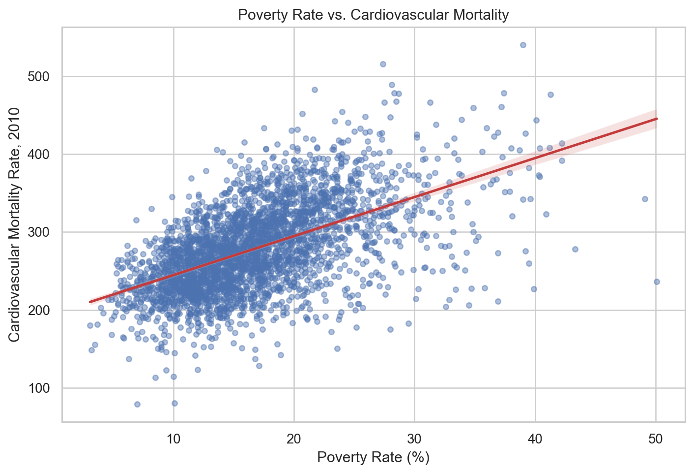
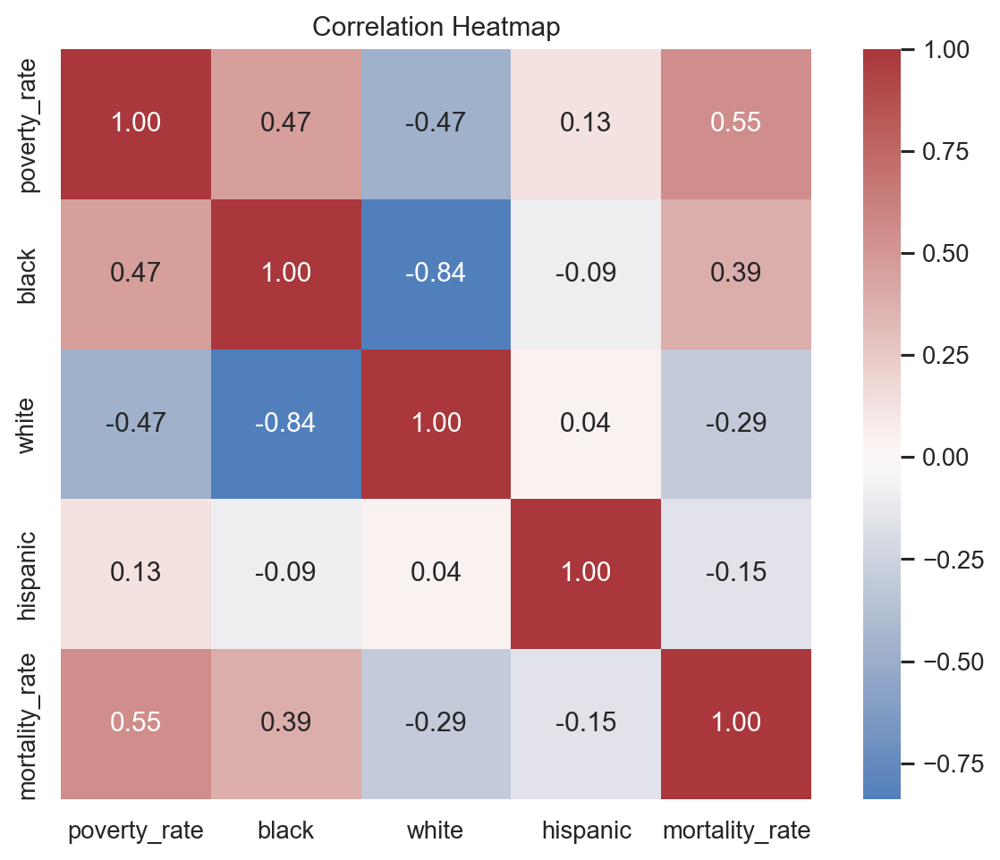
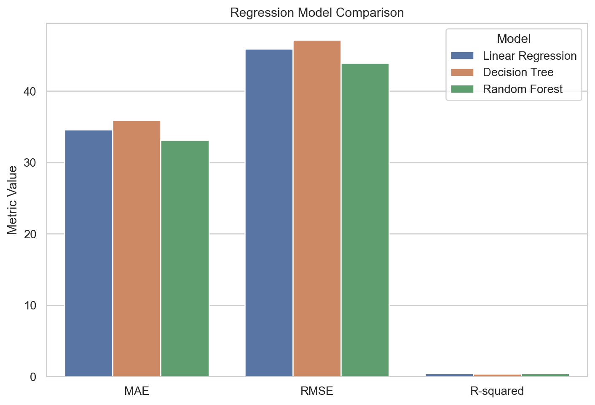
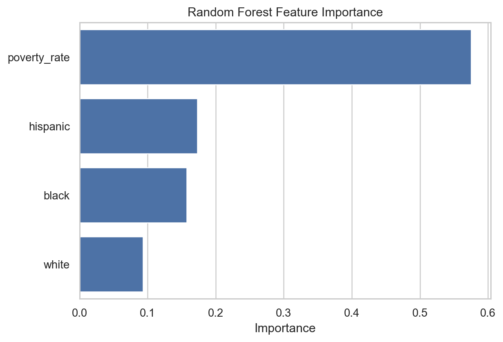

# Final Report: Socioeconomic and Demographic Factors in Cardiovascular Mortality Across U.S. Counties

**Course:** DSA 210 – Introduction to Data Science  
**Term:** Spring 2025–2026  
**Project Repository:** DSA210-TermProject  

---

## 1. Motivation

Cardiovascular mortality is not only a medical issue, but also a socioeconomic issue. Factors such as poverty, demographic composition, access to resources, and regional inequalities may be associated with differences in health outcomes across counties.

The main motivation of this project is to investigate whether county-level poverty and demographic variables are associated with cardiovascular mortality rates in the United States. Instead of focusing only on national averages, this project looks at county-level differences because local conditions may reveal inequalities that are hidden in broader national statistics.

The main research question of this project is:

**How are poverty levels and demographic composition associated with cardiovascular mortality rates across U.S. counties?**

---

## 2. Data Sources

This project combines three county-level datasets:

- Poverty data from the U.S. Census Bureau
- Demographic data from the U.S. Census Bureau
- Cardiovascular mortality data from a Kaggle dataset

The main variables used in the analysis were:

- `poverty_rate`
- `black`
- `white`
- `hispanic`
- `mortality_rate`

Using multiple datasets allowed the project to connect socioeconomic and demographic characteristics with health outcomes. This also enriched the mortality dataset with additional explanatory variables.

---

## 3. Data Preparation

The data preparation stage included cleaning and merging the datasets into a single county-level dataset. Since the datasets came from different sources, county and state information had to be aligned before analysis.

The final merged dataset included approximately 3,000 U.S. counties. After merging, the main focus was on the relationship between cardiovascular mortality rate and the selected socioeconomic and demographic variables.

The main preparation steps included:

- Loading the poverty, demographics, and mortality datasets
- Cleaning county and state information
- Merging datasets at the county level
- Selecting relevant variables for EDA, hypothesis testing, and machine learning
- Handling missing or incompatible values where necessary

---

## 4. Exploratory Data Analysis

The exploratory data analysis stage was used to understand the structure of the dataset and identify visible patterns before applying statistical tests and machine learning models.

The summary statistics showed that there is substantial variation across counties. Poverty rates and cardiovascular mortality rates are not evenly distributed, which suggests that socioeconomic and health outcomes differ significantly by location.

One of the most important EDA findings was the positive relationship between poverty rate and cardiovascular mortality rate. The scatter plot suggested that counties with higher poverty rates generally tend to have higher cardiovascular mortality rates. However, the relationship was not perfect, which suggests that poverty is an important factor but not the only determinant of cardiovascular mortality.

The demographic plots also suggested that county-level demographic composition is associated with mortality differences. In particular, counties with higher Black population shares tended to show higher cardiovascular mortality rates, while counties with higher White population shares showed a negative association. These patterns should be interpreted carefully because demographic composition may reflect broader socioeconomic, regional, and structural inequalities rather than direct causal effects.

---

## 5. Hypothesis Testing

Hypothesis testing was used to evaluate whether the relationships observed during EDA were statistically significant.

### Poverty and Cardiovascular Mortality

The Pearson correlation between poverty rate and cardiovascular mortality rate was:

- Correlation coefficient: `0.553`
- p-value: `3.018e-250`

This indicates a moderate positive association between poverty and cardiovascular mortality. Since the p-value was much smaller than 0.05, the relationship was statistically significant. Therefore, the null hypothesis of no association was rejected.

This means that counties with higher poverty rates tend to have higher cardiovascular mortality rates.

### High-Poverty and Low-Poverty Counties

A Welch two-sample t-test was used to compare cardiovascular mortality rates between high-poverty and low-poverty counties.

The result was:

- t-statistic: `31.164`
- p-value: `2.403e-184`

The result was statistically significant, showing that high-poverty and low-poverty counties differ significantly in cardiovascular mortality rates. This supports the earlier finding that poverty is strongly associated with cardiovascular mortality.

### Black Population Share and Cardiovascular Mortality

The Pearson correlation between Black population share and cardiovascular mortality rate was:

- Correlation coefficient: `0.387`
- p-value: `2.236e-112`

This result shows a statistically significant positive association. However, this correlation is weaker than the relationship between poverty and mortality.

This result should not be interpreted as ethnicity directly causing mortality differences. Instead, it may reflect broader socioeconomic inequalities, regional differences, healthcare access differences, and other structural factors.

### White Population Share and Cardiovascular Mortality

The Pearson correlation between White population share and cardiovascular mortality rate was:

- Correlation coefficient: `-0.294`
- p-value: `2.101e-63`

This indicates a statistically significant negative association. Counties with higher White population shares tended to have lower cardiovascular mortality rates. However, this result should also be interpreted carefully because demographic variables may be correlated with other socioeconomic and regional factors.

Overall, the hypothesis tests supported the EDA findings. Poverty had the strongest association with cardiovascular mortality among the tested variables.

---

## 6. Machine Learning Analysis

The machine learning part of the project tested whether poverty and demographic variables could be used to predict cardiovascular mortality rates.

Since the target variable, `mortality_rate`, is continuous this was a regression problem. The main model used was Random Forest Regressor. Random Forest was selected because it combines the predictions of multiple decision trees and can capture more complex, non-linear patterns than a simple linear model. Since in our research question there are vsrious featire. I added this model as well.

The original Random Forest Regressor results were:

- MAE: `33.130`
- RMSE: `43.917`
- R-squared: `0.453`

The MAE value means that the model's predictions differed from the actual mortality rates by about 33 deaths per 100,000 people on average. The RMSE was higher than the MAE, which suggests that the model made larger errors for some counties. The R-squared value of 0.453 means that the model explained about 45.3% of the variation in cardiovascular mortality rates.

This indicates moderate predictive performance. The selected variables contain meaningful predictive information, but they are not enough to fully explain cardiovascular mortality differences across counties.

---

## 7. Baseline Model Comparison

Based on TA feedback, I added a baseline model comparison for the final submission. Since the target variable is continuous, I used regression-based baseline models instead of Logistic Regression.

The models compared were:

- Linear Regression
- Decision Tree Regressor
- Random Forest Regressor

The results were:

| Model | MAE | RMSE | R-squared |
|---|---:|---:|---:|
| Linear Regression | 34.568 | 45.914 | 0.402 |
| Decision Tree Regressor | 35.917 | 47.183 | 0.368 |
| Random Forest Regressor | 33.130 | 43.917 | 0.453 |

The Random Forest Regressor performed best among the tested models. It had the lowest MAE and RMSE values and the highest R-squared score. This suggests that Random Forest was the best predictive model in this project because of the various features.

However, the improvement over Linear Regression was moderate. Linear Regression also explained about 40.2% of the variation in mortality rates, which suggests that part of the relationship between poverty, demographics, and mortality can be captured by a simple linear model. Random Forest improved the results slightly, likely because it can capture more complex and non-linear patterns.
---

## 8. Feature Importance

The Random Forest feature importance results were:

| Feature | Importance |
|---|---:|
| poverty_rate | 0.575 |
| hispanic | 0.173 |
| black | 0.158 |
| white | 0.093 |

The most important predictor was `poverty_rate`, which accounted for more than half of the total feature importance. This means that the Random Forest model relied most heavily on poverty rate when predicting cardiovascular mortality.

This result supports the earlier EDA and hypothesis testing findings, where poverty also showed the strongest association with cardiovascular mortality.

However, i want to emphasize that feature importance does not prove causality. It only shows which variables were most useful for prediction in the model.

---

## 9. Main Findings

The main findings of the project are:

1. Poverty rate was positively associated with cardiovascular mortality rate.
2. High-poverty counties had significantly different mortality rates compared to low-poverty counties.
3. Demographic composition was also associated with mortality differences across counties.
4. Poverty rate was the most important predictor in the Random Forest model.
5. Random Forest Regressor performed best among the tested machine learning models.
6. The model performance was moderate, which suggests that additional variables are needed to explain cardiovascular mortality more fully.

Overall, the results suggest that poverty is consistently associated with cardiovascular mortality across different stages of the project: EDA, hypothesis testing, and machine learning.

---

## 10. Personal Observations

One personal observation from this project is that poverty appeared as an important factor in every stage of the analysis. It was visible in the EDA plots, statistically supported by the hypothesis tests, and became the most important predictor in the Random Forest model.

This consistency made the poverty-mortality relationship more convincing to me. However, the machine learning results also showed that cardiovascular mortality is a complex outcome. Even though poverty and demographic variables had predictive value, the model only achieved moderate performance.

This helped me understand that data science results should be interpreted carefully. A statistically significant relationship does not automatically mean causation, and a model with moderate predictive performance does not fully explain the real-world issue.

---

## 11. Limitations and Future Work

There are several limitations in this project.

First, the analysis is based on county-level data. This means that the results describe patterns across counties, not individual people. Therefore, the results should not be interpreted as individual-level conclusions.

Second, the project is correlational, not causal. The analysis can show associations between poverty, demographics, and cardiovascular mortality, but it cannot prove that one variable directly causes another.

Third, the model only used a limited number of variables. Cardiovascular mortality is affected by many other factors, such as:

- Healthcare access
- Insurance coverage
- Age distribution
- Smoking rates
- Obesity rates
- Diet and physical activity
- Regional policies
- Urban-rural differences

Future work could improve the model by adding these variables. More advanced models or regional subgroup analysis could also be used to better understand why some counties have higher cardiovascular mortality rates than others.

---

## 12. Conclusion

This project investigated the relationship between poverty, demographic composition, and cardiovascular mortality across U.S. counties. The results showed that poverty was consistently associated with cardiovascular mortality in EDA, hypothesis testing, and machine learning.

The Random Forest model performed best among the tested models, but its performance was still moderate. This suggests that poverty and demographic variables contain meaningful information about cardiovascular mortality, but they do not fully explain it.

The main conclusion is that county-level socioeconomic disadvantage is strongly associated with cardiovascular mortality, but the relationship should be interpreted as correlation rather than causation.

---

## 13. References

- U.S. Census Bureau. County-level poverty estimates, 2010.
- U.S. Census Bureau / CORGIS County Demographics dataset. County-level demographic variables.
- Kaggle / IHME. U.S. county-level mortality dataset, 1980-2014.

---

## 14. AI Assistance Disclosure

AI tools were used as supporting tools during this project for debugging, improving code organization, clarifying statistical and machine learning concepts, interpreting model metrics, and polishing the wording of the report. Example prompts included asking for help interpreting correlation and p-values, comparing regression models, and organizing the final report according to the course guidelines. All analysis decisions, code execution, results, interpretations, and final edits were reviewed and approved by the student.
